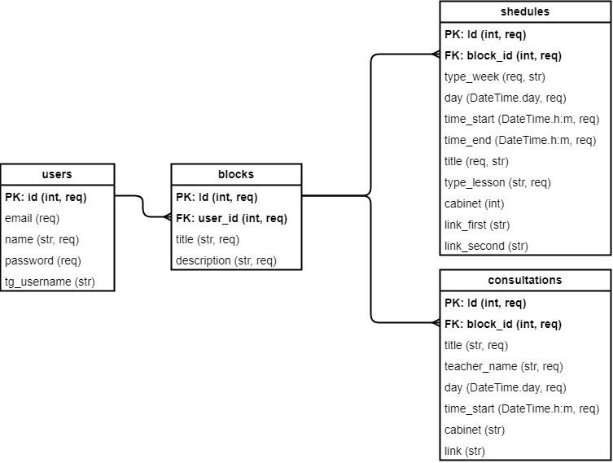
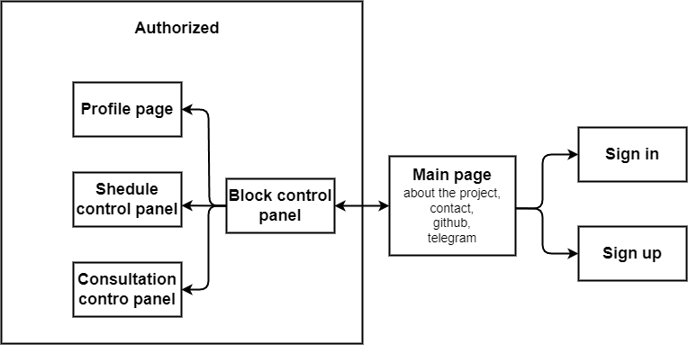

# Технічне завдання на розробку Веб-сайта та телеграм-бота для проєкту "Retold"

Розробники: Бутов Максим, Солод Ігор

Створено: 28.05.2024  
Оновлено: 26.08.2024

Дніпро, 2024

# Зміст

1. Загальні відомості про проєкт  
1.1 Опис проєкту  
1.2 Опис системи  
1.2.1 Функціональні блоки  
1.2.2 Типи користувачів  
1.2.3 Реєстрація  
1.2.4 Аутентифікація  
1.2.5 Зміна пароля  
1.2.6 Функціонал для автора  
1.2.7 Функціонал учасника  

- Глосарій

# 1. Загальні відомості про проєкт
## 1.1 Опис проєкту

Мета проєкту – розробити систему за допомогою якої можна створити на веб-сайті розклад занять та консультацій, список учасників групи університету поділених на підгрупи і список важливих подій. Для подальшої взаємодією із цією інформацією в телеграм боті, який може працювати в особистих повідомлення і в телеграм групі. 

## 1.2 Опис системи
### 1.2.1	Функціональні блоки 

**Веб-сайт**  
Система складається із таких функціональних блоків:  
1.	реєстрація та автентифікація користувачів на сайті (із використанням JwtToken);  
2.	створення, редагування та видалення блоків*;  
3.	створення, редагування та видалення таблиці розкладу занять;  
4.	створення, редагування та видалення таблиці розкладу консультацій;  

**Телеграм-бот**  
Система складається із таких функціональних блоків:
1.	автентифікація в телеграм боті через прив'язку аккаунту телеграм на сайті; 
2.	передача із БД в чат розклад занять на поточний та наступний тижні;  
3.	передача із БД в чат розклад консультацій;  
4.	знаходження та відправка поточного та наступного заняття; 
5.	читання статусу повітряної тривоги та відправка статусу повітряної тривоги в м. Дніпро. 

### 1.2.2 Типи користувачів  

В системі передбачено два типи користувачів: зареєстрований (далі автор*) та незареєстрований (далі учасник*). Зареєстрований користувач може використовувати функціонал сайту та завдяки створеному на сайті ключу може активувати бота в телеграмі. Ключ створюється для кожного автора (блок* – одиниця інформації в системі, до блока входять розклад занять, розклад консультацій). Ключ по якому бот працює в чаті / групі можна оновити на сайті, тільки якщо користувач який підключив цей ключ відв'яже його через сайт.  

Незареєстровані користувачі можуть використовувати функціонал вже підключеного до групи бота і не можуть змінювати його налаштування.  

### 1.2.3 Реєстрація 

Система працює таким чином, що один користувач може мати багато блоків, при цьому кожен блок може бути прив'язаним тільки до одного користувача. 
При реєстрації система видає запрошення на введення полів: 
- email – обов'язкове поле; 
- username – обов'язкове поле; 
- пароль – обов'язкове поле.

### 1.2.4 Аутентифікація 

Аутентифікація на сайті буде проходити за допомогою email та пароля користувача. Для авторизації в боті, після команди "/start" вказати телеграм токен, який знаходиться на сайті в профілі автора.  

### 1.2.5 Зміна пароля 

Якщо авторизований користувач хоче змінити свій пароль, то на сторінці "профіль", він може задати новий пароль.  

### 1.2.6 Функціонал для автора  

Автор після авторизації (введення логіну та пароля) отримує доступ до панелі керування блоками, та отримує такий функціонал взаємодії із блоками:  
1. створення блока, при цьому у БД створюється рядок у таблиці "Blocks"; 
2. видалення блока, у БД видаляється блок із усім його вмістом та прив'язаними до нього таблицями; 
3. редагування блока, в створеному блоці під час редагування можна: 
	- додати, відредагувати та видалити рядок в таблиці розкладу занять; 
	- додати, відредагувати та видалити рядок в таблиці розкладу консультацій.

### 1.2.7	Функціонал учасника  

Учасник після додавання та активації бота автором в групі може:
1. отримати розклад занять на поточний тиждень; 
2. отримати розклад занять на наступний тиждень; 
2. отримати розклад занять; 
3. отримати розклад консультацій; 
4. отримати поточне заняття (із статусом повітряної тривоги); 
5. отримати наступне заняття (із статусом повітряної тривоги);

## 1.3 Діаграми

### Структура бази даних

### Структура веб-сайта

 	  

# Глосарій 
- Блок – одиниця інформації в системі, до блока  входить розклад занять, розклад консультацій; 
- автор – зареєстрований на сайті користувач; 
- учасник - незареєстрований на сайті користувач; 
